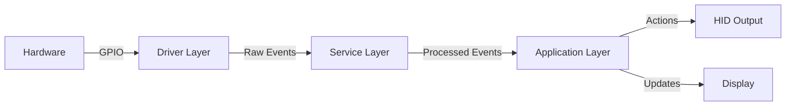
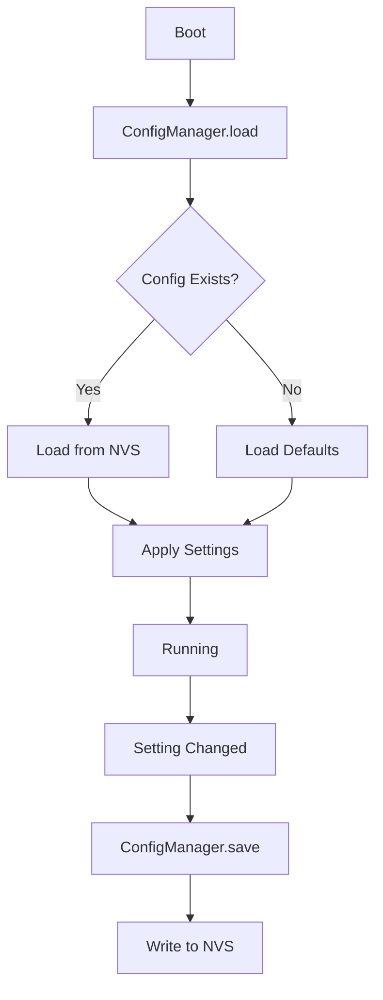
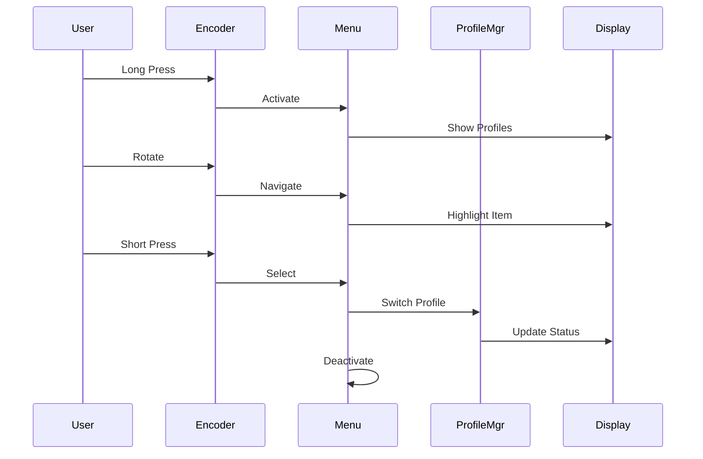

# ESP32-S3 Macropad Architecture

## Table of Contents

- [Overview](#overview)
- [System Architecture](#system-architecture)
- [Module Design](#module-design)
- [Data Flow](#data-flow)
- [State Management](#state-management)
- [Memory Layout](#memory-layout)
- [Threading Model](#threading-model)
- [Configuration System](#configuration-system)

## Overview

The ESP32-S3 Macropad is designed with a modular architecture that separates concerns and allows for easy testing, maintenance, and extension.

### Design Principles

1. **Separation of Concerns**: Each module handles a specific aspect of functionality
2. **Loose Coupling**: Modules communicate through well-defined interfaces
3. **High Cohesion**: Related functionality is grouped together
4. **Testability**: Modules can be tested independently
5. **Extensibility**: New features can be added without modifying existing code

## System Architecture

```
┌─────────────────────────────────────────────────────────────┐
│                         Application Layer                    │
│  ┌────────────┐  ┌────────────┐  ┌─────────────────────┐   │
│  │ Main Loop  │  │ Menu System│  │ Profile Manager     │   │
│  └────────────┘  └────────────┘  └─────────────────────┘   │
└────────────┬─────────────────────────────────┬──────────────┘
             │                                 │
┌────────────┴─────────────────────────────────┴──────────────┐
│                      Service Layer                           │
│  ┌────────────┐  ┌────────────┐  ┌────────────────────┐    │
│  │ Input Mgr  │  │Display Mgr │  │  Config Manager    │    │
│  └────────────┘  └────────────┘  └────────────────────┘    │
└────────────┬─────────────────────────────────┬──────────────┘
             │                                 │
┌────────────┴─────────────────────────────────┴──────────────┐
│                       Driver Layer                           │
│  ┌──────────┐  ┌──────────┐  ┌──────────┐  ┌──────────┐   │
│  │ Keypad   │  │ Encoder  │  │ Display  │  │   HID    │   │
│  └──────────┘  └──────────┘  └──────────┘  └──────────┘   │
└────────────────────────────────────────────────────────────┘
             │
┌────────────┴──────────────────────────────────────────────┐
│                    Hardware Abstraction                     │
│  ┌──────────┐  ┌──────────┐  ┌──────────┐  ┌──────────┐  │
│  │   GPIO   │  │   I2C    │  │   USB    │  │Preferences│  │
│  └──────────┘  └──────────┘  └──────────┘  └──────────┘  │
└────────────────────────────────────────────────────────────┘
```

## Module Design

### 1. Hardware Abstraction Layer (HAL)

#### Purpose
Provides low-level hardware access and initialization.

#### Components
- **GPIO**: Pin configuration and digital I/O
- **I2C**: Communication bus for OLED
- **USB**: HID device interface
- **Preferences**: Non-volatile storage (NVS)

### 2. Driver Layer

#### KeypadDriver (`lib/KeypadDriver/`)
```cpp
class KeypadDriver {
public:
  void begin();
  char getKey();
  bool isPressed(char key);
private:
  Keypad _keypad;
};
```

**Responsibilities:**
- Matrix scanning
- Debouncing
- Key event generation

#### EncoderDriver (`lib/EncoderDriver/`)
```cpp
class EncoderDriver {
public:
  void begin();
  int8_t getRotation();  // -1, 0, +1
  bool isButtonPressed();
  bool isButtonLongPressed();
private:
  Encoder _encoder;
  unsigned long _buttonPressStart;
};
```

**Responsibilities:**
- Quadrature decoding
- Button state tracking
- Long press detection

#### DisplayDriver (`lib/DisplayDriver/`)
```cpp
class DisplayDriver {
public:
  void begin();
  void clear();
  void drawText(int x, int y, const char* text);
  void drawIcon(int x, int y, const uint8_t* icon);
  void display();
private:
  Adafruit_SSD1306 _display;
};
```

**Responsibilities:**
- OLED initialization
- Low-level drawing primitives
- Screen buffer management

#### HIDDriver (`lib/HIDDriver/`)
```cpp
class HIDDriver {
public:
  void begin();
  void sendKey(uint8_t modifiers, uint8_t keycode);
  void sendConsumerKey(uint16_t usage);
  bool isConnected();
private:
  USBHID _hid;
};
```

**Responsibilities:**
- HID report descriptor
- Key/consumer code transmission
- Connection status

### 3. Service Layer

#### InputManager (`lib/InputManager/`)
```cpp
class InputManager {
public:
  void begin();
  void update();
  char getKeyPress();
  int8_t getEncoderDelta();
  bool isEncoderPressed();
  bool isEncoderLongPressed();
private:
  KeypadDriver _keypad;
  EncoderDriver _encoder;
};
```

**Responsibilities:**
- Aggregate input from all devices
- Event queue management
- Input filtering

#### DisplayManager (`lib/DisplayManager/`)
```cpp
class DisplayManager {
public:
  void begin();
  void showSplash();
  void showProfile(const char* name);
  void showMenu(const char** items, int count, int selected);
  void showStatus(const char* text);
private:
  DisplayDriver _driver;
  void _drawHeader();
  void _drawFooter();
};
```

**Responsibilities:**
- High-level UI rendering
- Screen layouts
- Animations and transitions

#### ConfigManager (`lib/ConfigManager/`)
```cpp
class ConfigManager {
public:
  void begin();
  void load();
  void save();
  uint8_t getCurrentProfile();
  void setCurrentProfile(uint8_t profile);
  uint8_t getBrightness();
  void setBrightness(uint8_t level);
private:
  Preferences _prefs;
};
```

**Responsibilities:**
- Persistent settings storage
- Configuration defaults
- Load/save operations

### 4. Application Layer

#### ProfileManager (`lib/ProfileManager/`)
```cpp
class ProfileManager {
public:
  void begin();
  void loadProfiles(const char* filepath);
  Profile* getCurrentProfile();
  void setProfile(uint8_t index);
  uint8_t getProfileCount();
private:
  std::vector<Profile> _profiles;
  uint8_t _currentIndex;
};
```

**Responsibilities:**
- Profile loading from JSON
- Profile switching
- Keymap lookup

#### MenuSystem (`lib/MenuSystem/`)
```cpp
class MenuSystem {
public:
  void begin();
  void show();
  void hide();
  void navigate(int8_t direction);
  void select();
  bool isActive();
private:
  enum State { HIDDEN, PROFILE_SELECT, SETTINGS };
  State _state;
  int _selectedItem;
};
```

**Responsibilities:**
- Menu navigation logic
- User interface state
- Settings management

## Data Flow

### Input Processing Flow



### Configuration Flow



### Profile Switching Flow



## State Management

### Application States

```cpp
enum class AppState {
  SPLASH,       // Boot screen
  NORMAL,       // Normal operation
  MENU,         // Menu navigation
  SETTINGS,     // Settings screen
  POST_TEST     // Hardware test mode
};
```

### State Transitions

```
SPLASH ──(timeout)──> NORMAL
NORMAL ──(long press)──> MENU
MENU ──(select profile)──> NORMAL
MENU ──(select settings)──> SETTINGS
SETTINGS ──(back)──> MENU
NORMAL ──(boot + button)──> POST_TEST
```

### State Machine

```cpp
class StateMachine {
public:
  void transition(AppState newState);
  AppState getState();
  void update();
private:
  AppState _currentState;
  void _onEnter(AppState state);
  void _onExit(AppState state);
};
```

## Memory Layout

### Flash Memory (4MB)

```
┌─────────────────────────┐ 0x0000000
│   Bootloader            │ 64KB
├─────────────────────────┤
│   Partition Table       │ 4KB
├─────────────────────────┤
│   NVS (Config)          │ 20KB
├─────────────────────────┤
│   OTA Data              │ 8KB
├─────────────────────────┤
│   Firmware (App0)       │ 1.5MB
├─────────────────────────┤
│   Firmware (App1)       │ 1.5MB
├─────────────────────────┤
│   SPIFFS (Keymaps)      │ 512KB
└─────────────────────────┘
```

### RAM Usage (512KB SRAM)

```
┌─────────────────────────┐
│   Stack                 │ ~16KB
├─────────────────────────┤
│   Heap                  │ ~200KB
├─────────────────────────┤
│   Display Buffer        │ 1KB
├─────────────────────────┤
│   USB Buffers           │ 8KB
├─────────────────────────┤
│   WiFi/BLE (optional)   │ ~100KB
├─────────────────────────┤
│   System Reserved       │ ~180KB
└─────────────────────────┘
```

### Optimization Strategies

1. **Use `const` for lookup tables** (stored in flash, not RAM)
2. **Minimize global variables**
3. **Use references instead of copying structs**
4. **Free unused drivers** (WiFi/BLE if not needed)
5. **Compress bitmaps and icons**

## Threading Model

### Task Overview

The firmware uses cooperative multitasking via the Arduino loop():

```cpp
void loop() {
  // 1. Read inputs (~1ms)
  inputManager.update();
  
  // 2. Process state machine (~1ms)
  stateMachine.update();
  
  // 3. Handle current state (~5ms)
  switch (stateMachine.getState()) {
    case NORMAL: handleNormalMode(); break;
    case MENU: handleMenuMode(); break;
    // ...
  }
  
  // 4. Update display (~10ms)
  displayManager.update();
  
  // 5. Send HID reports if needed (~1ms)
  if (keyPressed) hidDriver.sendKey();
  
  // Total: ~18ms per loop = ~55 FPS
  delay(2);  // Yield to system
}
```

### Timing Requirements

| Task | Max Time | Frequency |
|------|----------|-----------|
| Input Scan | 1ms | Every loop |
| Display Update | 16ms | 60 FPS |
| HID Send | 1ms | On event |
| Config Save | 100ms | On change |

## Configuration System

### Storage Format

```cpp
// NVS Key-Value Pairs
"profile"       : uint8_t   // Current profile index
"brightness"    : uint8_t   // Display brightness 0-255
"volume"        : uint8_t   // Encoder volume sensitivity
"debounce"      : uint8_t   // Key debounce time (ms)
"long_press"    : uint16_t  // Long press threshold (ms)
"keymap"        : String    // Active keymap name
```

### Configuration Loading

```cpp
void ConfigManager::begin() {
  _prefs.begin("macropad", false);
  
  // Load with defaults
  _config.profile = _prefs.getUChar("profile", 0);
  _config.brightness = _prefs.getUChar("brightness", 128);
  _config.debounce = _prefs.getUChar("debounce", 10);
  // ...
}
```

### JSON Keymap Loading

Keymaps are stored in SPIFFS and loaded at runtime:

```cpp
void ProfileManager::loadProfiles(const char* path) {
  File file = SPIFFS.open(path, "r");
  DynamicJsonDocument doc(8192);
  deserializeJson(doc, file);
  
  for (JsonObject profile : doc["profiles"].as<JsonArray>()) {
    _profiles.push_back(parseProfile(profile));
  }
}
```

## Error Handling

### Error Types

```cpp
enum class ErrorCode {
  NONE,
  I2C_TIMEOUT,
  DISPLAY_INIT_FAILED,
  KEYMAP_NOT_FOUND,
  KEYMAP_PARSE_ERROR,
  NVS_WRITE_FAILED,
  HID_NOT_CONNECTED
};
```

### Error Recovery

1. **Non-Critical Errors**: Log to serial, continue operation
2. **Critical Errors**: Show error screen, enter safe mode
3. **Hardware Failures**: Attempt recovery, fall back to POST mode

### Safe Mode

If critical error occurs:
1. Disable all non-essential features
2. Show error message on display
3. Allow basic navigation to settings
4. Provide factory reset option

## Testing Strategy

### Unit Tests

Each module should have unit tests:

```cpp
TEST(KeypadDriver, DebounceWorks) {
  KeypadDriver keypad;
  // Test debounce logic
}

TEST(ProfileManager, LoadsValidJSON) {
  ProfileManager pm;
  pm.loadProfiles("/test_keymap.json");
  EXPECT_EQ(pm.getProfileCount(), 2);
}
```

### Integration Tests

Test module interactions:

```cpp
TEST(InputToHID, KeyPressTriggersHID) {
  InputManager input;
  HIDDriver hid;
  ProfileManager profiles;
  
  input.simulateKeyPress('1');
  profiles.handleInput(&input, &hid);
  EXPECT_TRUE(hid.wasKeySent(KEY_C));
}
```

### Hardware-in-Loop Tests

Run on actual hardware:
- POST test validates all hardware
- Manual testing for user interactions
- Long-running stability tests

## Extension Points

### Adding New Input Devices

1. Create new driver in `lib/`
2. Register with InputManager
3. Add event handling in state machine

### Adding New Profiles

1. Edit keymap JSON
2. No code changes needed
3. Reload configuration

### Adding New Display Screens

1. Add screen method to DisplayManager
2. Add state to StateMachine
3. Implement state handling

## Performance Considerations

### Optimization Guidelines

1. **Minimize allocations in loop()**
2. **Use const references for large structs**
3. **Batch display updates**
4. **Cache frequently accessed data**
5. **Avoid floating point math**

### Profiling

Monitor performance metrics:
- Loop time (should be <20ms)
- Free heap (should be >100KB)
- Stack usage (should be <8KB)
- Display frame rate (target 30+ FPS)

---

## References

- [ESP32-S3 Technical Reference](https://www.espressif.com/sites/default/files/documentation/esp32-s3_technical_reference_manual_en.pdf)
- [Arduino Style Guide](https://docs.arduino.cc/learn/contributions/arduino-library-style-guide)
- [PlatformIO Documentation](https://docs.platformio.org/)
